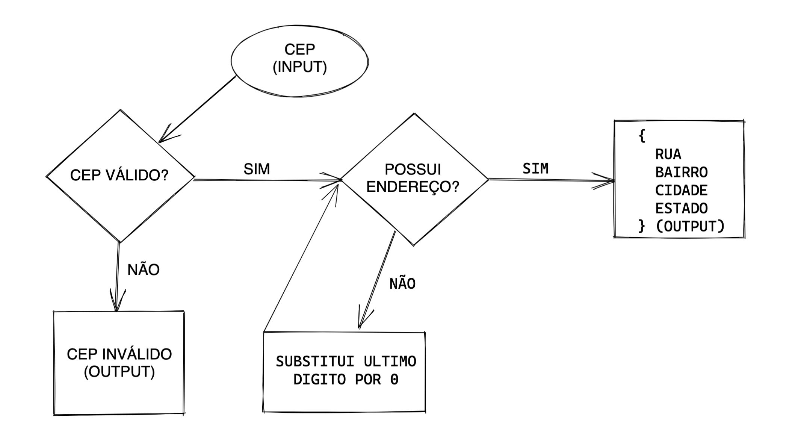

# CEP SERVICE

## Requisitos
* [Java 11](https://www.oracle.com/br/java/technologies/javase-jdk11-downloads.html)

## Descrição do serviço
Expor um serviço de CEP que dado um CEP válido informe:
* Logradouro, Bairro, Cidade e Estado.

Caso o CEP seja válido, mas não há um endereço, 
é substituído o último digito da direita para esquerda com 0 até que seja encontrado um endereço.

Caso o CEP seja inválido é retornado um erro informando o problema encontrado no valor passado.

## Design do desafio

## Escolha da linguagem e do framework
Foi escolhida a linguagem Java por ser amplamente difundida na criação de APIs REST,
segura e que possui uma grande comunidade e base de documentação criada ao longo dos anos.
O framework SpringBoot foi escolhido, baseado na mesma linha de raciocínio, trazendo um grande 
suporte para o desenvolvimento do desafio.

## Implementação
Todas as regras de negócios implementadas no desafio possuem testes de unidade para validação
de possíveis problemas que podem ocorrer na manutenção do código.

O desafio foi escrito a utilizar alguns designs patterns que facilitam a troca do serviço externo
do CEP. Nesse exemplo foi utilizado o serviço [ViaCep](https://viacep.com.br/) por permitir uma 
fácil implementação e facilidade no uso.

Outra escolha realizada na implementação do desafio foi cachear as requisições feitas ao serviço.
Visto que a utilização de serviço externo para obter as informações do endereço é algo custoso e passível
de instabilidades.

## Build da aplicação localmente

O build da aplicação pode ser realizada como um projeto Maven.

A aplicação possui apenas um endpoint: [GET] http://localhost:8080/{CEP}

Ao subir a aplicação é disponibilizado um serviço do Swagger UI para facilitar os testes:

[Swagger UI](http://localhost:8080/swagger-ui.html)